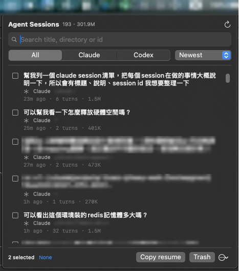

# Agent Sessions

A macOS menu bar app and CLI for the coding-agent sessions you have already
finished. It reads the transcripts Claude Code and Codex leave on disk, gives each
one a readable title, and lets you find one, drop back into it, or clear it out.

- Indexes every Claude Code transcript in `~/.claude/projects` and every Codex
  rollout in `~/.codex/sessions`, each titled by the first prompt you actually
  typed rather than the context the harness injects.
- A menu bar list and a full-screen terminal browser, both multi-select.
- Resume a session, copy its resume command, or move it to the Trash.
- Finds a session from a vague description by handing the judgement to the
  `claude` or `codex` CLI you already have installed.
- Counts real user turns and the disk each session takes, so it also shows what
  is eating space.
- Local files and no telemetry. Nothing leaves the machine unless you run `ask`.

## Install

Needs macOS 14 or newer, a Swift 6 toolchain (`swift --version`, provided by
Xcode 16), and Claude Code or Codex.

```sh
git clone https://github.com/johney4415/agent-sessions.git
cd agent-sessions
make install
```

That builds in release mode and installs the same binary twice — the CLI at
`~/.local/bin/agent-sessions`, and `~/Applications/Agent Sessions.app` for the
menu bar.

```sh
open ~/Applications/Agent\ Sessions.app   # no window: it lives in the menu bar
agent-sessions --version                  # check the CLI is on PATH
```

If the CLI is not found, put `~/.local/bin` on your `PATH`:

```sh
echo 'export PATH="$HOME/.local/bin:$PATH"' >> ~/.zshrc && exec zsh
```

To start it with the machine, add it under **System Settings → General → Login
Items**. To update, `git pull && make install`. To remove the CLI, the app and the
parse cache, `./scripts/uninstall.sh` — your transcripts are never touched.

## Usage

### The menu bar list



Click the list icon in the menu bar to open it. Type in the search box to filter —
every word has to match the title, the directory or the id — and use the pickers
to show one CLI or change the order.

Click rows to select them, then **Copy resume** for one `cd … && claude --resume …`
line per session, or **Trash** to move the transcripts to the Trash after
confirming. Right-click a single row to copy its id or reveal the transcript in
Finder; the `⋯` menu selects everything shown, or quits the app.

The first open scans every transcript and takes a few seconds; after that it comes
from the cache. The circular arrow rescans on demand.

### The terminal browser

`agent-sessions` with no arguments opens the same list full-screen:

```
agent-sessions  197 sessions                     All · Newest · 301.9M
  / to search, ? to describe what you remember
  ───────────────────────────────────────────────────────────────────
❯ ◉ 幫我啟用這個工具
    1a2b3c4d  claude  1m ago      2t     610K   ~/projects/agent-sessions
  ○ stock
    5e6f7a8b  codex   12m ago     564t   54.2M  ~/Documents/Codex/…
  ───────────────────────────────────────────────────────────────────
  1 selected
  ↑↓ move · space select · / search · ? ask · enter resume · c copy …
```

| Key | Action |
| --- | --- |
| `↑` `↓` / `k` `j` | Move the cursor |
| `space` | Select the row; `a` selects everything shown, `x` clears |
| `/` | Filter by word |
| `?` | Describe the session you want and let claude or codex find it |
| `enter` | Resume the session under the cursor, in this terminal |
| `c` `d` | Copy the resume command, or move to the Trash after a `y` |
| `s` `f` `r` | Cycle sort, cycle provider, rescan |
| `esc` | Drop the search, then the filter, then quit |
| `q` | Quit |

`enter` replaces the process with `claude --resume …` in the session's own
directory, so you land back inside the agent. With nothing selected, `c` and `d`
act on the row under the cursor. A run with no terminal — a pipe, a cron job —
prints the list instead.

### Finding one by description

Word search only finds what you can spell. `ask` is for the sessions you remember
by what happened in them.

```sh
agent-sessions ask "the one where we chased the redis memory limit"
agent-sessions ask --agent codex --limit 3 "清理磁碟空間那次"
```

The agent shortlists from the metadata, then reads the prompts of the sessions it
shortlisted and ranks what actually matches — a title is only the first thing you
typed, so a session on the right subject often has an unrelated one. The matches
open in the browser, sorted by relevance, with the reason for the highlighted row
on the bottom line. `--plain` and `--json` print them instead.

This is the one command that is not local. It runs `claude -p` or `codex exec`
under the login you already have, so it needs no API key and what it sends goes
wherever that agent already sends your prompts. It sends one metadata line per
session, then the prompts *you typed* in the dozen it shortlisted; assistant
replies, tool calls and file contents are never read. `--dry-run` prints the
prompt and sends nothing. Each search also leaves one short session of its own,
titled `agent-sessions search: …`.

### From scripts

```sh
agent-sessions list                          # print, newest first
agent-sessions list --sort largest -n 10     # what is eating disk
agent-sessions list --codex --search redis
agent-sessions resume 1a2b3c4d               # print the resume command
eval "$(agent-sessions resume 1a2b3c4d)"     # or jump straight back in
agent-sessions delete 1a2b3c4d 5e6f7a8b      # move to Trash, with confirmation
agent-sessions refresh                       # rebuild the parse cache
agent-sessions list --plain | fzf -m | cut -f1 | xargs agent-sessions delete
```

Ids are matched by prefix, so the eight characters the list shows are enough; a
prefix matching more than one session is reported rather than guessed at.
`--plain` gives one tab-separated line per session and `--json` the full records.
`resume` takes `--copy`, and `delete` takes `--yes` and `--permanent`, the one way
this tool removes a transcript unrecoverably.

`agent-sessions help` lists every command and option.

MIT licensed.
